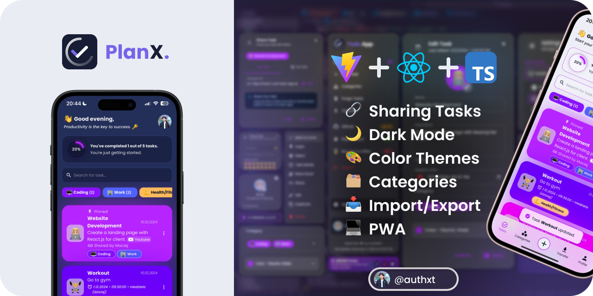

# PlanX

## [https://PlanX.vercel.app](https://planx.vercel.app/)

## 💻 Tech Stack

<ul style="display: flex; flex-direction: column; gap:10px;">
  <li style="vertical-align: middle;">
     React
  </li>
    <li style="vertical-align: middle;">
     Typescript
  </li>
    <li style="vertical-align: middle;">
     Vite
  </li>
  <li style="vertical-align: middle;">
     Vitest
  </li>
  <li style="vertical-align: middle;">
     Emotion
  </li>
    <li style="vertical-align: middle;">
     Material UI (MUI)
  </li>
</ul>

## ⚡ Features

### 🔗 Share Tasks by Link or QR Code

Easily share your tasks with others using a link or QR code, with the option to download the QR code.

**[Example Link](https://planx.vercel.app/share?task=N4IgJg9gdgpiBcAzAhgGwM4wDQgA4EspYwEUNsQpkBbOeEASWtwgCcAXAegFEAPFjgAIAKsnQBrdCBxgY6AMat8udvmgIQAVUyt0g+ciiD8zNu0GGwgmPzOD2YyfYidErCNUEApAMoB5ADlBRHxUOQA6EQALfD1EGGR2AFdWGAtUVAgAdz0knT12CEEAI2R5cUEk3HsomHxWe0c9NntWQ3R4hvZaz0LBCG6YBtkAN3x5OWsxUIBPcOkQeQhM1g0AYgBmAEFuAA4NgDYFsES6EAAmAAZzgFYAWkv7gEYb4Uun+Evd+CeAdnCXjcAFrHBJgVCEM5XW4PX53F5vD5fT6XcKXdEgnAGdgwADmbBmCAA2qB8CR6Lsbr9EJcwMUDncACwbYrnJkbGDFO67J7Mu4weSMmDnA6M363J5HHBUWgaAASHjgOBg1AgACt8BonogOZcFksVuttYhEIzGSAAL5YUnkkDXACc53kpXuiAOwqZT0Fd2KN2QcPkN3tyEuyGQAviGwWMrOAHU2OIFir1Zr6NqOed9cs2OtzozdjATZbrSAyRpkChLog6Yy7m6DrsmWA-Xdg2BLkzhecwOdigXdoyntGaGduGAkti1FAk6qNVrTScs4b6GsTQW85aALoWoA&userName=SIJAN)**

### 🤖 AI Emoji Suggestions

This uses `window.ai` which is an experimental feature that works only in dev version of Chrome with some flags enabled. [More info](https://afficone.com/blog/window-ai-new-chrome-feature-api/)

Code: [src/components/EmojiPicker.tsx](https://github.com/authxt/planx/blob/main/src/components/EmojiPicker.tsx#L116)

### 🗣️ Task Reading Aloud

Option to have tasks read aloud using the native `SpeechSynthesis` API, with a selection of voices to choose from.

### 📥 Import/Export Tasks

Users can import and export tasks to/from JSON files. This feature allows users to back up their tasks or transfer them to other devices easily. [Example Import File](https://github.com/authxt/planx/blob/main/example-import.json)

### 📴 Progressive Web App (PWA)

This app is a Progressive Web App (PWA), which means it can be installed on your device, used even when you're offline and behave like a normal application with shortcuts and badges.

### 🔄 Update Prompt

The app features a custom update prompt that notifies users when a new version is available, allowing for easy refresh to access the latest improvements.

### 📱 Custom Splash Screens

The app automatically generates custom splash screens for various iOS and iPadOS devices in both light and dark modes. These splash screens provide a smooth, native-like launch experience when the app is opened as a PWA.

To generate splash screens:

- Development: `npm run generate-splash:dev`
- Production: `npm run generate-splash:prod` (automatically runs during build)

## 👨‍💻 Installation

To install and run the project locally, follow these steps:

- Clone the repository: `git clone https://github.com/authxt/PlanX.git`
- Navigate to the project directory: `cd PlanX`
- Install the dependencies: `npm install`
- Start the development server: `npm run dev`

The app will now be running at [http://localhost:5173/](http://localhost:5173/).

> [!TIP]
> For mobile device testing, use `npm run dev:host` to preview the app on your local network.
